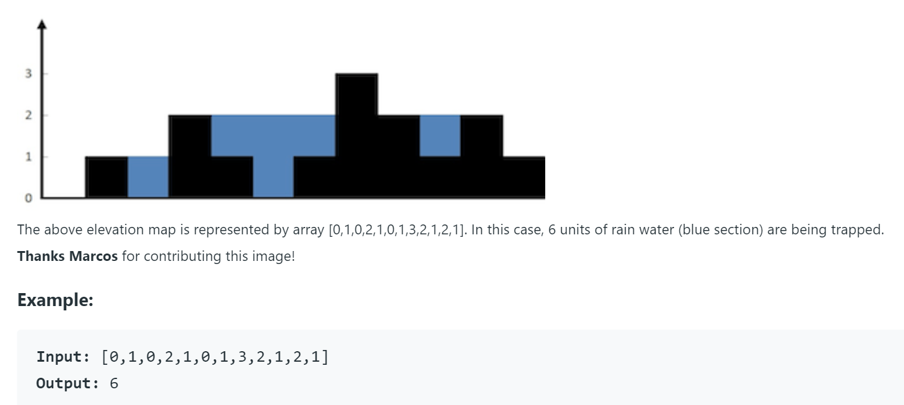

# Coding Challenge - 006: Calculating the Amount of Water to be Trapped on Terrain

The purpose of this coding challenge is to write a program that calculates the amount of water that can be contained within the generated holes.

## Learning Outcomes

At the end of this coding challenge, students will be able to;

- analyze a problem, identify, and apply programming knowledge for appropriate solution.

- design, implement `while` loops effectively in Python to solve the given problem.

- control loops effectively by using `if` and `control` statements.

- demonstrate their knowledge of algorithmic design principles by using solving the problem effectively.

## Problem Statement

- Given an array of non-negative integers representing an elevation map as shown below where the width of each bar is 1, compute how much water will be trapped on terrain after raining. To clarify further, the black boxes represents terrain and its height, and the blue boxes represents the water that could be trapped on the terrain.



- User can enter as many numbers as they want to represent elevation of the terrain.

- You can assume all the inputs are valid, thus you don't have to do an input check.

- At the end of the program write a comment that indicates which computational thinking heuristics you have used and how you used them.

- Example of user inputs and respective outputs.

```text
Inputs
------------------------------
Type 'ok' when you are done: 5
Type 'ok' when you are done: 4
Type 'ok' when you are done: 5
Type 'ok' when you are done: ok

Output
------
1

Inputs
------------------------------
Type 'ok' when you are done: 2
Type 'ok' when you are done: 1
Type 'ok' when you are done: 2
Type 'ok' when you are done: 3
Type 'ok' when you are done: 2
Type 'ok' when you are done: 3
Type 'ok' when you are done: ok

Output
------
2

Inputs
------------------------------
Type 'ok' when you are done: 6
Type 'ok' when you are done: 5
Type 'ok' when you are done: 8
Type 'ok' when you are done: 9
Type 'ok' when you are done: 2
Type 'ok' when you are done: 4
Type 'ok' when you are done: 3
Type 'ok' when you are done: 6
Type 'ok' when you are done: ok

Output
------
10
```
